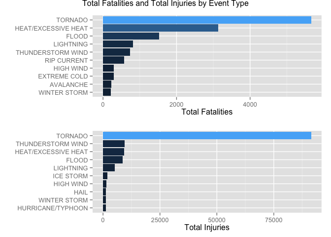
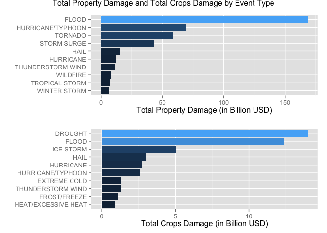

# Reproducible Research: Peer Assessment 2

# Storms and Severe Weather Events in United States: Human and Economic impacts.

##Synopsis
Storms and severe weather events cause public health and economic problems for communities and municipalities. Severe events can result in fatalities, injuries, and property damage and even damages to crops. For these reason preventing such outcomes is a key concern. In this study we will study the "U.S. National Oceanic and Atmospheric Administration's" (NOAA) storm database in order to determine which events are most harmful with respect to human casualities and material damage.

###System information (Platform, OS, Version of R and R Packages used)
In case you would like to reproduce this analysis, this is the information of the system that was used:


```r
sessionInfo()
```

```
## R version 3.2.0 (2015-04-16)
## Platform: x86_64-apple-darwin13.4.0 (64-bit)
## Running under: OS X 10.10.3 (Yosemite)
## 
## locale:
## [1] en_US.UTF-8/en_US.UTF-8/en_US.UTF-8/C/en_US.UTF-8/en_US.UTF-8
## 
## attached base packages:
## [1] grid      stats     graphics  grDevices utils     datasets  methods  
## [8] base     
## 
## other attached packages:
## [1] gridExtra_0.9.1 sqldf_0.4-10    RSQLite_1.0.0   DBI_0.3.1      
## [5] gsubfn_0.6-6    proto_0.3-10    ggplot2_1.0.1  
## 
## loaded via a namespace (and not attached):
##  [1] Rcpp_0.11.6      knitr_1.10.5     magrittr_1.5     MASS_7.3-40     
##  [5] munsell_0.4.2    colorspace_1.2-6 stringr_1.0.0    plyr_1.8.2      
##  [9] tools_3.2.0      gtable_0.1.2     htmltools_0.2.6  yaml_2.1.13     
## [13] digest_0.6.8     reshape2_1.4.1   formatR_1.2      evaluate_0.7    
## [17] rmarkdown_0.6.1  stringi_0.4-1    scales_0.2.4     chron_2.3-45
```

The following packages are used for this analysis:


```r
library(ggplot2)
library(sqldf)
library(grid)
library(gridExtra)
```

## Data Processing

The data for this analysis comes in the form of a comma-separated-value (csv) file compressed via the bzip2 algorithm to reduce its size. The file can download the file can be downloaded from this [link.](https://d396qusza40orc.cloudfront.net/repdata%2Fdata%2FStormData.csv.bz2). The events in the database start in the year 1950 and end in November 2011. 

The following R code can be used to download the raw data and load it in R for further processing.


```r
if(!file.exists("StormData.csv.bz2")){
        download.file("https://d396qusza40orc.cloudfront.net/repdata%2Fdata%2FStormData.csv.bz2", 
                      "/Users/skom/Desktop/coursera/Rep_Research/RepData_PeerAssessment2/StormData.csv.bz2",
                      method="curl")
}

data <- read.csv(bzfile("StormData.csv.bz2"))
```

Based on the raw data, four datasets were generated to analyze the impacts of the different events in relation to:
        
1. Fatalities
2. Injuries
3. Propery Damage
4. Crop Damage

### 1. Fatalities
For this part of the analysis, column FATALITIES was aggregated in relation to EVTYPE. After this initial aggregation EVTYPE was tidied up and FATALITIES were aggregated once again based on these "Cleaned" event types. Top 10 events are used for the analysis.


```r
ct_fat <- sqldf("select UPPER(EVTYPE) EVTYPE, SUM(FATALITIES) count from data 
                where FATALITIES>0 group by UPPER(EVTYPE) 
                order by 2 desc")

ct_fat[grepl("AVAL",ct_fat$EVTYPE),1]<- "AVALANCHE"
ct_fat[grepl("HEAT",ct_fat$EVTYPE),1]<-"HEAT/EXCESSIVE HEAT"
ct_fat[grepl("TORNADO",ct_fat$EVTYPE),1] <- "TORNADO"
ct_fat[grepl("TSTM|THUNDERST",ct_fat$EVTYPE),1] <- "THUNDERSTORM WIND"
ct_fat[grepl("FLOOD",ct_fat$EVTYPE),1] <- "FLOOD"
ct_fat[grepl("LIGHTNING",ct_fat$EVTYPE),1]<-"LIGHTNING"
ct_fat[grepl("RIP",ct_fat$EVTYPE),1]<-"RIP CURRENT"
ct_fat[grepl("HIGH WIND",ct_fat$EVTYPE),1]<-"HIGH WIND" 
ct_fat[grepl("WINTER STORM",ct_fat$EVTYPE),1]<-"WINTER STORM" 
ct_fat[grepl("EXTREME COLD",ct_fat$EVTYPE),1] <-"EXTREME COLD"

FATALITIES <- sqldf("select UPPER(EVTYPE) EVENT_TYPE, sum(count) FATALITIES from ct_fat
                    group by UPPER(EVTYPE) 
                    order by 2 desc")
TOP10_FATALITIES <- head(FATALITIES,10)
```

### 2. Injuries
For this part of the analysis, column INJURIES was aggregated in relation to EVTYPE. After this initial aggregation EVTYPE was tidied up and INJURIES were aggregated once again based on these "Cleaned" event types. Top 10 events are used for the analysis.


```r
ct_inj <- sqldf("select UPPER(EVTYPE) EVTYPE, SUM(INJURIES) count from data
                where INJURIES>0 group by UPPER(EVTYPE) 
                order by 2 desc")

ct_inj[grepl("AVAL",ct_inj$EVTYPE),1]<- "AVALANCHE"
ct_inj[grepl("HEAT",ct_inj$EVTYPE),1]<-"HEAT/EXCESSIVE HEAT"
ct_inj[grepl("TORNADO",ct_inj$EVTYPE),1] <- "TORNADO"
ct_inj[grepl("TSTM|THUNDERST",ct_inj$EVTYPE),1] <- "THUNDERSTORM WIND"
ct_inj[grepl("FLOOD",ct_inj$EVTYPE),1] <- "FLOOD"
ct_inj[grepl("LIGHTNING",ct_inj$EVTYPE),1]<-"LIGHTNING"
ct_inj[grepl("RIP",ct_inj$EVTYPE),1]<-"RIP CURRENT"
ct_inj[grepl("HIGH WIND",ct_inj$EVTYPE),1]<-"HIGH WIND" 
ct_inj[grepl("WINTER STORM",ct_inj$EVTYPE),1]<-"WINTER STORM" 
ct_inj[grepl("EXTREME COLD",ct_inj$EVTYPE),1] <-"EXTREME COLD"

INJURIES <- sqldf("select UPPER(EVTYPE) EVENT_TYPE, sum(count) INJURIES from ct_inj 
                  group by UPPER(EVTYPE) order by 2 desc")
TOP10_INJURIES <- head(INJURIES,10)
```

### 3. Property Damage
For this part of the analysis, columns EVTYPE, PROPDMG and PROPDMGEXP are used (we keep values from the raw data that have PROPDMG>0. PROPDMGEXP needed major cleaning as it represented exponents in the form of a number (for example 3 meaning 1e+03) and letters (for example K or k also meaning 1e+03). After the relevant cleaning is down PROPDMG and PROPDMGEXP are multiplied and aggregated by EVTYPE. After this initial aggregation EVTYPE was tidied up and Property Damage was aggregated once again based on these "Cleaned" event types. Top 10 events are used for the analysis.


```r
# Property Damage

DMG_PROP <- sqldf("select UPPER(EVTYPE) EVTYPE, PROPDMG, UPPER(PROPDMGEXP) PROPDMGEXP from data where PROPDMG > 0")
DMG_PROP$PROPDMGEXP <- as.character(DMG_PROP$PROPDMGEXP)
unique(DMG_PROP$PROPDMGEXP)
```

```
##  [1] "K" "M" "B" "+" "0" ""  "5" "6" "4" "H" "2" "7" "3" "-"
```

```r
DMG_PROP$PROPDMGEXP[DMG_PROP$PROPDMGEXP == "H"] <- 100
DMG_PROP$PROPDMGEXP[DMG_PROP$PROPDMGEXP == "K"] <- 1000
DMG_PROP$PROPDMGEXP[DMG_PROP$PROPDMGEXP == "M"] <- 1000000
DMG_PROP$PROPDMGEXP[DMG_PROP$PROPDMGEXP == "B"] <- 1000000000
DMG_PROP$PROPDMGEXP[DMG_PROP$PROPDMGEXP == "7"] <- 1e+07
DMG_PROP$PROPDMGEXP[DMG_PROP$PROPDMGEXP == "6"] <- 1e+06
DMG_PROP$PROPDMGEXP[DMG_PROP$PROPDMGEXP == "5"] <- 1e+05
DMG_PROP$PROPDMGEXP[DMG_PROP$PROPDMGEXP == "4"] <- 1e+04
DMG_PROP$PROPDMGEXP[DMG_PROP$PROPDMGEXP == "3"] <- 1e+03
DMG_PROP$PROPDMGEXP[DMG_PROP$PROPDMGEXP == "2"] <- 1e+02
DMG_PROP$PROPDMGEXP[DMG_PROP$PROPDMGEXP == "0"] <- 1
DMG_PROP$PROPDMGEXP[DMG_PROP$PROPDMGEXP == "-"] <- 0
DMG_PROP$PROPDMGEXP[DMG_PROP$PROPDMGEXP == ""] <- 1
DMG_PROP$PROPDMGEXP[DMG_PROP$PROPDMGEXP == "+"] <- 0
DMG_PROP$PROPDMGEXP <- as.numeric(DMG_PROP$PROPDMGEXP)
DMG_PROP$PROPDMGVAL <- DMG_PROP$PROPDMG*DMG_PROP$PROPDMGEXP

DMG_PROP[grepl("AVAL",DMG_PROP$EVTYPE),1]<- "AVALANCHE"
DMG_PROP[grepl("HEAT",DMG_PROP$EVTYPE),1]<-"HEAT/EXCESSIVE HEAT"
DMG_PROP[grep("TORNADO",DMG_PROP$EVTYPE),1] <- "TORNADO"
DMG_PROP[grepl("TSTM|THUNDERST",DMG_PROP$EVTYPE),1] <- "THUNDERSTORM WIND"
DMG_PROP[grepl("FLOOD",DMG_PROP$EVTYPE),1] <- "FLOOD"
DMG_PROP[grepl("LIGHTNING",DMG_PROP$EVTYPE),1]<-"LIGHTNING"
DMG_PROP[grepl("RIP",DMG_PROP$EVTYPE),1]<-"RIP CURRENT"
DMG_PROP[grepl("HIGH WIND",DMG_PROP$EVTYPE),1]<-"HIGH WIND" 
DMG_PROP[grepl("WINTER STORM",DMG_PROP$EVTYPE),1]<-"WINTER STORM" 
DMG_PROP[grepl("EXTREME COLD",DMG_PROP$EVTYPE),1] <-"EXTREME COLD"
DMG_PROP[grepl("WILD",DMG_PROP$EVTYPE),1] <-"WILDFIRE"
DMG_PROP[grepl("STRONG",DMG_PROP$EVTYPE),1] <-"STRONG WIND"


PROPVAL <- sqldf("select UPPER(EVTYPE) EVENT_TYPE, sum(PROPDMGVAL) TOTAL from DMG_PROP group by UPPER(EVTYPE) order by 2 desc")
TOP10_PROPVAL <- head(PROPVAL,10)
```

### 4. Crop Damage
For this part of the analysis, columns EVTYPE, CROPDMG and CROPDMGEXP are used (we keep values from the raw data that have CROPDMG>0. CROPDMGEXP needed major cleaning as it represented exponents in the form of a number (for example 3 meaning 1e+03) and letters (for example K or k also meaning 1e+03). After the relevant cleaning is done CROPDMG and CROPDMGEXP are multiplied and aggregated by EVTYPE. After this initial aggregation EVTYPE was tidied up and Crop Damage was aggregated once again based on these "Cleaned" event types. Top 10 events are used for the analysis.


```r
DMG_CROP <- sqldf("select UPPER(EVTYPE) EVTYPE, CROPDMG, UPPER(CROPDMGEXP) CROPDMGEXP from data where CROPDMG > 0")
DMG_CROP$CROPDMGEXP <- as.character(DMG_CROP$CROPDMGEXP)
unique(DMG_CROP$CROPDMGEXP)
```

```
## [1] "M" "K" "B" "0" ""
```

```r
DMG_CROP$CROPDMGEXP[DMG_CROP$CROPDMGEXP == "K"] <- 1000
DMG_CROP$CROPDMGEXP[DMG_CROP$CROPDMGEXP == "M"] <- 1000000
DMG_CROP$CROPDMGEXP[DMG_CROP$CROPDMGEXP == "B"] <- 1000000000
DMG_CROP$CROPDMGEXP[DMG_CROP$CROPDMGEXP == "0"] <- 1
DMG_CROP$CROPDMGEXP[DMG_CROP$CROPDMGEXP == ""] <- 1
DMG_CROP$CROPDMGEXP <- as.numeric(DMG_CROP$CROPDMGEXP)
DMG_CROP$CROPDMGVAL <- DMG_CROP$CROPDMG*DMG_CROP$CROPDMGEXP


DMG_CROP[grepl("AVAL",DMG_CROP$EVTYPE),1]<- "AVALANCHE"
DMG_CROP[grepl("HEAT",DMG_CROP$EVTYPE),1]<-"HEAT/EXCESSIVE HEAT"
DMG_CROP[grepl("TORNADO",DMG_CROP$EVTYPE),1] <- "TORNADO"
DMG_CROP[grepl("TSTM|THUNDERST",DMG_CROP$EVTYPE),1] <- "THUNDERSTORM WIND"
DMG_CROP[grepl("FLOOD",DMG_CROP$EVTYPE),1] <- "FLOOD"
DMG_CROP[grepl("LIGHTNING",DMG_CROP$EVTYPE),1]<-"LIGHTNING"
DMG_CROP[grepl("RIP",DMG_CROP$EVTYPE),1]<-"RIP CURRENT"
DMG_CROP[grepl("HIGH WIND",DMG_CROP$EVTYPE),1]<-"HIGH WIND" 
DMG_CROP[grepl("WINTER STORM",DMG_CROP$EVTYPE),1]<-"WINTER STORM" 
DMG_CROP[grepl("EXTREME COLD",DMG_CROP$EVTYPE),1] <-"EXTREME COLD"
DMG_CROP[grepl("WILD",DMG_CROP$EVTYPE),1] <-"WILDFIRE"
DMG_CROP[grepl("STRONG",DMG_CROP$EVTYPE),1] <-"STRONG WIND"

CROPVAL <- sqldf("select UPPER(EVTYPE) EVENT_TYPE, sum(CROPDMGVAL) TOTAL from DMG_CROP group by UPPER(EVTYPE) order by 2 desc")
TOP10_CROPVAL <- head(CROPVAL,10)
```


##Results
The following panel plot shows the top 10 weather events responsible for fatalities and the top 10 weather events responsible for injuries.


```r
p1 <- ggplot(data=TOP10_FATALITIES, aes(x=reorder(EVENT_TYPE,FATALITIES), y=FATALITIES, fill=FATALITIES)) +
        geom_bar(stat="identity") + coord_flip() + xlab("") + 
        ylab("Total Fatalities") + 
        theme(legend.position="none")
p2 <- ggplot(data=TOP10_INJURIES, aes(x=reorder(EVENT_TYPE,INJURIES), y=INJURIES, fill=INJURIES)) +
        geom_bar(stat="identity") + coord_flip() + xlab("") + 
        ylab("Total Injuries") +
        theme(legend.position="none")

grid.arrange(p1,p2, main = "Total Fatalities and Total Injuries by Event Type")
```

 

It can be observed that Tornados are the most harmful to population health both for Fatalities and Injuries.

The following panel plot shows the top 10 weather events responsible for property damage and the top 10 weather events responsible for crop damage.


```r
p3 <- ggplot(data=TOP10_PROPVAL, aes(x=reorder(EVENT_TYPE,TOTAL), y=TOTAL/1e+09, fill=TOTAL)) +
        geom_bar(stat="identity") + coord_flip() + xlab("") + 
        ylab("Total Property Damage (in Billion USD)") + 
        theme(legend.position="none")
p4 <- ggplot(data=TOP10_CROPVAL, aes(x=reorder(EVENT_TYPE,TOTAL), y=TOTAL/1e+09, fill=TOTAL)) +
        geom_bar(stat="identity") + coord_flip() + xlab("") + 
        ylab("Total Crops Damage (in Billion USD)") + 
        theme(legend.position="none")

grid.arrange(p3,p4, main = "Total Property Damage and Total Crops Damage by Event Type")
```

 

It can be observed that Floods cause the most Property Damage and Droughts the most Crops Damage.

